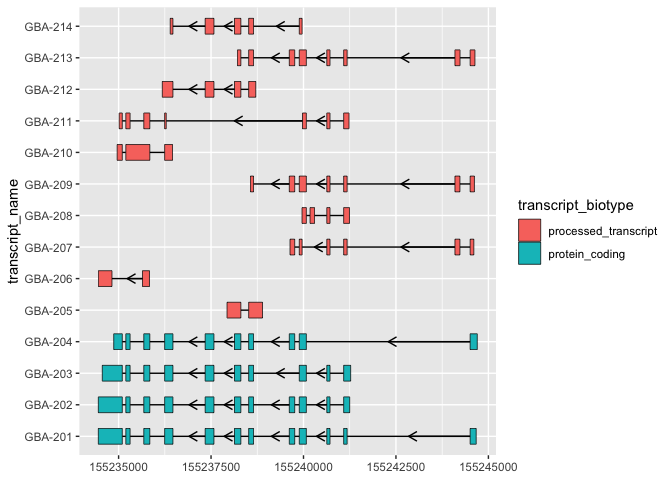

# ggtranscript

<!-- badges: start -->

[](https://github.com/dzhang32/ggtranscript/issues)
[](https://github.com/dzhang32/ggtranscript/pulls)
[](https://lifecycle.r-lib.org/articles/stages.html#experimental)
[](https://github.com/dzhang32/ggtranscript/actions)
[](https://app.codecov.io/gh/dzhang32/ggtranscript?branch=main)
<!-- badges: end -->

`ggtranscript` is a `ggplot2` extension that makes it easy visualize
transcript structure and annotation.

## Installation instructions

``` r
devtools::install_github("dzhang32/ggtranscript")
```

## Example

`ggtranscript` introduces 3 new `geom`s designed to make visualising
transcript structures easier. `geom_range()` for exons (and genomic
range based annotations), `geom_intron()` for introns and
`geom_junction()` for overlaying junction data with transcript
structures.

``` r
library(magrittr)
library(ggplot2)
library(ggtranscript)

# gene annotation for the an example gene (GBA)
gba_ens_105
#> # A tibble: 165 × 8
#>    seqnames     start       end strand type        gene_name transcript_name
#>    <fct>        <int>     <int> <fct>  <fct>       <chr>     <chr>          
#>  1 1        155234452 155244699 -      gene        GBA       <NA>           
#>  2 1        155234452 155241249 -      transcript  GBA       GBA-202        
#>  3 1        155241086 155241249 -      exon        GBA       GBA-202        
#>  4 1        155241086 155241112 -      CDS         GBA       GBA-202        
#>  5 1        155241110 155241112 -      start_codon GBA       GBA-202        
#>  6 1        155240630 155240717 -      exon        GBA       GBA-202        
#>  7 1        155240630 155240717 -      CDS         GBA       GBA-202        
#>  8 1        155239886 155240077 -      exon        GBA       GBA-202        
#>  9 1        155239886 155240077 -      CDS         GBA       GBA-202        
#> 10 1        155239616 155239762 -      exon        GBA       GBA-202        
#> # … with 155 more rows, and 1 more variable: transcript_biotype <chr>

# obtain exons
gba_ens_105_exons <- gba_ens_105 %>%
    dplyr::filter(type == "exon")

gba_ens_105_exons %>%
    ggplot(aes(
        xstart = start,
        xend = end,
        y = transcript_name
    )) +
    geom_range(aes(fill = transcript_biotype)) +
    geom_intron(
        data = to_intron(gba_ens_105_exons, transcript_name),
        aes(
            xstart = intron_start,
            xend = intron_end,
            strand = as.character(strand)
        ),
        arrow.min.intron.length = 500,
    )
```



## Code of Conduct

Please note that the `ggtranscript` project is released with a
[Contributor Code of
Conduct](http://bioconductor.org/about/code-of-conduct/). By
contributing to this project, you agree to abide by its terms.

## Development tools

-   Continuous code testing is possible thanks to [GitHub
    actions](https://www.tidyverse.org/blog/2020/04/usethis-1-6-0/)
    through *[usethis](https://CRAN.R-project.org/package=usethis)*,
    *[remotes](https://CRAN.R-project.org/package=remotes)*, and
    *[rcmdcheck](https://CRAN.R-project.org/package=rcmdcheck)*
    customized to use [Bioconductor’s docker
    containers](https://www.bioconductor.org/help/docker/) and
    *[BiocCheck](https://bioconductor.org/packages/3.14/BiocCheck)*.
-   Code coverage assessment is possible thanks to
    [codecov](https://codecov.io/gh) and
    *[covr](https://CRAN.R-project.org/package=covr)*.
-   The [documentation website](http://dzhang32.github.io/ggtranscript)
    is automatically updated thanks to
    *[pkgdown](https://CRAN.R-project.org/package=pkgdown)*.
-   The code is styled automatically thanks to
    *[styler](https://CRAN.R-project.org/package=styler)*.
-   The documentation is formatted thanks to
    *[devtools](https://CRAN.R-project.org/package=devtools)* and
    *[roxygen2](https://CRAN.R-project.org/package=roxygen2)*.

This package was developed using
*[biocthis](https://bioconductor.org/packages/3.14/biocthis)*.
