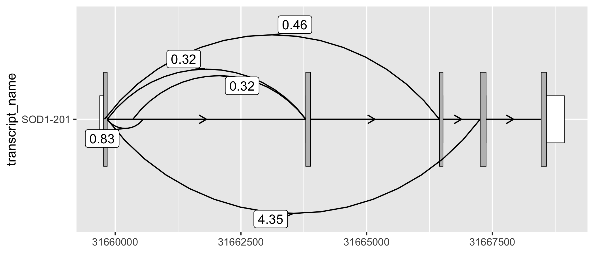

# ggtranscript 

<!-- badges: start -->

[](https://github.com/dzhang32/ggtranscript/issues)
[](https://github.com/dzhang32/ggtranscript/pulls)
[](https://lifecycle.r-lib.org/articles/stages.html#experimental)
[](https://github.com/dzhang32/ggtranscript/actions)
[](https://app.codecov.io/gh/dzhang32/ggtranscript?branch=main)
<!-- badges: end -->

`ggtranscript` is a `ggplot2` extension that makes it to easy to
visualize transcript structure and annotation.

## Installation

``` r
# you can install the development version of ggtranscript from GitHub:
# install.packages("devtools")
devtools::install_github("dzhang32/ggtranscript")
```

## Usage

`ggtranscript` introduces 5 new geoms (`geom_range()`,
`geom_half_range()`, `geom_intron()`, `geom_junction()` and
`geom_junction_label_repel()`) and several helper functions designed to
facilitate the visualization of transcript structure and annotation. The
following guide takes you on a whistle stop tour of using these geoms,
for a more extensive overview see the [Getting Started
tutorial](https://dzhang32.github.io/ggtranscript/articles/ggtranscript.html).

`geom_range()` and `geom_intron()` enable the plotting of exons and
introns, the core components of transcript annotation. `ggtranscript`
also provides `to_intron()`, which converts exon co-ordinates to the
corresponding introns. Together, `ggtranscript` enables users to plot
transcript structures with only exons as the required input and just a
few lines of code.

``` r
library(magrittr)
library(dplyr)
#> 
#> Attaching package: 'dplyr'
#> The following objects are masked from 'package:stats':
#> 
#>     filter, lag
#> The following objects are masked from 'package:base':
#> 
#>     intersect, setdiff, setequal, union
library(ggplot2)
library(ggtranscript)

# to illustrate the package's functionality
# ggtranscript includes example transcript annotation
sod1_annotation %>% head()
#> # A tibble: 6 × 8
#>   seqnames  start    end strand type  gene_name transcript_name transcript_biot…
#>   <fct>     <int>  <int> <fct>  <fct> <chr>     <chr>           <chr>           
#> 1 21       3.17e7 3.17e7 +      gene  SOD1      <NA>            <NA>            
#> 2 21       3.17e7 3.17e7 +      tran… SOD1      SOD1-202        protein_coding  
#> 3 21       3.17e7 3.17e7 +      exon  SOD1      SOD1-202        protein_coding  
#> 4 21       3.17e7 3.17e7 +      CDS   SOD1      SOD1-202        protein_coding  
#> 5 21       3.17e7 3.17e7 +      star… SOD1      SOD1-202        protein_coding  
#> 6 21       3.17e7 3.17e7 +      exon  SOD1      SOD1-202        protein_coding

# extract exons
sod1_exons <- sod1_annotation %>% dplyr::filter(type == "exon")

sod1_exons %>%
    ggplot(aes(
        xstart = start,
        xend = end,
        y = transcript_name
    )) +
    geom_range(
        aes(fill = transcript_biotype)
    ) +
    geom_intron(
        data = to_intron(sod1_exons, "transcript_name"),
        aes(strand = strand)
    )
```


`geom_range()` can be used for any range-based genomic annotation. For
example, when plotting protein-coding transcripts, users may find it
helpful to visually distinguish the coding segments from UTRs.

``` r
# filter for only exons from protein coding transcripts
sod1_exons_prot_cod <- sod1_exons %>%
    dplyr::filter(transcript_biotype == "protein_coding")

# obtain cds
sod1_cds <- sod1_annotation %>% dplyr::filter(type == "CDS")

sod1_exons_prot_cod %>%
    ggplot(aes(
        xstart = start,
        xend = end,
        y = transcript_name
    )) +
    geom_range(
        fill = "white",
        height = 0.25
    ) +
    geom_range(
        data = sod1_cds
    ) +
    geom_intron(
        data = to_intron(sod1_exons_prot_cod, "transcript_name"),
        aes(strand = strand),
        arrow.min.intron.length = 500,
    )
```


`geom_half_range()` takes advantage of the vertical symmetry of
transcript annotation by plotting only half of a range on the top or
bottom of a transcript structure. One use case of `geom_half_range()` is
to visualize the differences between transcript structure more clearly.

``` r
# extract exons and cds for the two transcripts to be compared
sod1_201_exons <- sod1_exons %>% dplyr::filter(transcript_name == "SOD1-201")
sod1_201_cds <- sod1_cds %>% dplyr::filter(transcript_name == "SOD1-201")
sod1_202_exons <- sod1_exons %>% dplyr::filter(transcript_name == "SOD1-202")
sod1_202_cds <- sod1_cds %>% dplyr::filter(transcript_name == "SOD1-202")

sod1_201_202_plot <- sod1_201_exons %>%
    ggplot(aes(
        xstart = start,
        xend = end,
        y = "SOD1-201/202"
    )) +
    geom_half_range(
        fill = "white",
        height = 0.125
    ) +
    geom_half_range(
        data = sod1_201_cds
    ) +
    geom_intron(
        data = to_intron(sod1_201_exons, "transcript_name")
    ) +
    geom_half_range(
        data = sod1_202_exons,
        range.orientation = "top",
        fill = "white",
        height = 0.125
    ) +
    geom_half_range(
        data = sod1_202_cds,
        range.orientation = "top",
        fill = "purple"
    ) +
    geom_intron(
        data = to_intron(sod1_202_exons, "transcript_name")
    )

sod1_201_202_plot
```


As a `ggplot2` extension, `ggtranscript` inherits the the familiarity
and functionality of `ggplot2`. For instance, by leveraging
`coord_cartesian()` users can zoom in on regions of interest.

``` r
sod1_201_202_plot + coord_cartesian(xlim = c(31659500, 31660000))
```


`geom_junction()` enables to plotting of junction curves, which can be
overlaid across transcript structures. `geom_junction_label_repel()`
adds a label to junction curves, which can often be useful to mark
junctions with a metric of their usage such as read counts.

``` r
# ggtranscript includes a set of example (unannotated) junctions
# originating from GTEx and downloaded via the Bioconductor package snapcount
sod1_junctions
#> # A tibble: 5 × 5
#>   seqnames    start      end strand mean_count
#>   <fct>       <int>    <int> <fct>       <dbl>
#> 1 chr21    31659787 31666448 +           0.463
#> 2 chr21    31659842 31660554 +           0.831
#> 3 chr21    31659842 31663794 +           0.316
#> 4 chr21    31659842 31667257 +           4.35 
#> 5 chr21    31660351 31663789 +           0.324

# add transcript_name to junctions for plotting
sod1_junctions <- sod1_junctions %>%
    dplyr::mutate(transcript_name = "SOD1-201")

sod1_201_exons %>%
  ggplot(aes(
    xstart = start,
    xend = end,
    y = transcript_name
  )) +
  geom_range(
    fill = "white", 
    height = 0.25
  ) +
  geom_range(
    data = sod1_201_cds
  ) + 
  geom_intron(
    data = to_intron(sod1_201_exons, "transcript_name")
  ) + 
  geom_junction(
    data = sod1_junctions,
    junction.y.max = 0.5
  ) +
  geom_junction_label_repel(
    data = sod1_junctions,
    aes(label = round(mean_count, 2)),
    junction.y.max = 0.5
  )
```



Alternatively, users may prefer to map junction read counts to the
thickness of the junction curves. As a `ggplot2` extension, this can be
done intuitively by modifying the size `aes()` of `geom_junction()`. In
addition, by modifying `ggplot2` scales and themes, users can easily
create informative, publication-ready plots.

``` r
sod1_201_exons %>%
  ggplot(aes(
    xstart = start,
    xend = end,
    y = transcript_name
  )) +
  geom_range(
    fill = "white", 
    height = 0.25
  ) +
  geom_range(
    data = sod1_201_cds
  ) + 
  geom_intron(
    data = to_intron(sod1_201_exons, "transcript_name")
  ) + 
  geom_junction(
    data = sod1_junctions,
    aes(size = mean_count),
    junction.y.max = 0.5, 
    ncp = 30, 
    colour = "purple"
  ) + 
  scale_size_continuous(range = c(0.1, 1), guide = "none") + 
  xlab("Genomic position (chr21)") + 
  ylab("Transcript name") + 
  theme_bw()
```


## Contributing

Interested in contributing? Check out the [contributing
guidelines](.github/CONTRIBUTING.md). Please note that this project is
released with a [Code of
Conduct](https://bioconductor.github.io/bioc_coc_multilingual/). By
contributing to this project, you agree to abide by its terms.

## Citation

``` r
citation("ggtranscript")
#> 
#> To cite package 'ggtranscript' in publications use:
#> 
#>   David Zhang and Emil Gustavsson (2021). ggtranscript: Visualizing
#>   transcript structure and annotation using ggplot2. R package version
#>   0.99.2. https://github.com/dzhang32/ggtranscript
#> 
#> A BibTeX entry for LaTeX users is
#> 
#>   @Manual{,
#>     title = {ggtranscript: Visualizing transcript structure and annotation using ggplot2},
#>     author = {David Zhang and Emil Gustavsson},
#>     year = {2021},
#>     note = {R package version 0.99.2},
#>     url = {https://github.com/dzhang32/ggtranscript},
#>   }
```

## Credits

-   `ggtranscript` was developed using
    *[biocthis](https://bioconductor.org/packages/3.14/biocthis)* .
